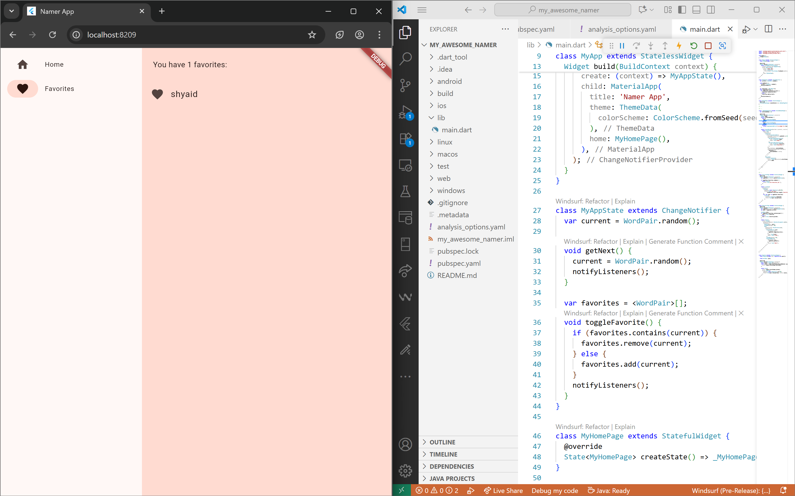

# Laporan Praktikum Mobile - Flutter Dasar

**Nama**  : Kamila Habiba Putri Ananta  
**NIM**   : 2341720175  
**Kelas** : 3D  

---
## Praktikum
### Praktikum 1 - Text Widget
Menyambungkan laptop ke handphone dan menampilkan teks sederhana dengan style   

**Hasil**  

---

### Praktikum 2 - Image Widget
Menampilkan gambar dari asset yang didefinisikan di `pubspec.yaml`.  

**Hasil**  

---

### Praktikum 3 - Dialog & Input/Selection Widget
Menampilkan dialog sederhana (AlertDialog) serta input teks menggunakan `TextField`.  

**Hasil**  

---

### Praktikum 4 - Date & Time Picker
Menampilkan pilihan tanggal dan waktu menggunakan `showDatePicker` serta `showTimePicker`.  

**Hasil**  

---

# Tugas 

### Langkah 1: Membuat Project & Setup Awal  
Membuat project Flutter baru (misalnya `namer_app`), mengatur file `pubspec.yaml`, `analysis_options.yaml`, dan `main.dart` awal dari template.  
**Hasil**  

---

### Langkah 2: Menjalankan Aplikasi & Hot Reload  
Menjalankan aplikasi di emulator/perangkat dan memodifikasi teks agar hot reload bekerja (UI langsung diperbarui).  
**Hasil**  

---

### Langkah 3: Menambah Tombol “Next”  
Menambahkan tombol `ElevatedButton` agar pengguna dapat menghasilkan nama baru ketika ditekan. Menambahkan method `getNext()` di kelas `MyAppState` untuk menghasilkan `WordPair` baru, dan memanggilnya dalam callback tombol. 

**Hasil**  

---

### Langkah 4: Mempercantik UI & Extract Widget  
Memisahkan widget menjadi bagian tersendiri, menambahkan `Padding`, `Card`, dan menerapkan tema agar tampilan lebih menarik.  
**Hasil**  

---

### Langkah 5: Menambahkan Fungsi Favorit (“Like”)  
Menambahkan properti `favorites` dalam `MyAppState`, serta method `toggleFavorite()` untuk menambah atau menghapus dari favorit. Menambahkan tombol like / ikon di UI.  
**Hasil**  

---

### Langkah 6: Menambahkan Navigasi / NavigationRail  
Membuat tampilan multi-halaman (Home & Favorites) menggunakan `NavigationRail` dan mengganti `MyHomePage` menjadi `StatefulWidget` agar dapat merespon perubahan indeks navigasi.  
**Hasil**  

---

### Langkah 7: Responsivitas & LayoutBuilder  
Menggunakan `LayoutBuilder` agar ketika layar cukup lebar, `NavigationRail` menampilkan label (extended).  
**Hasil**  

---

