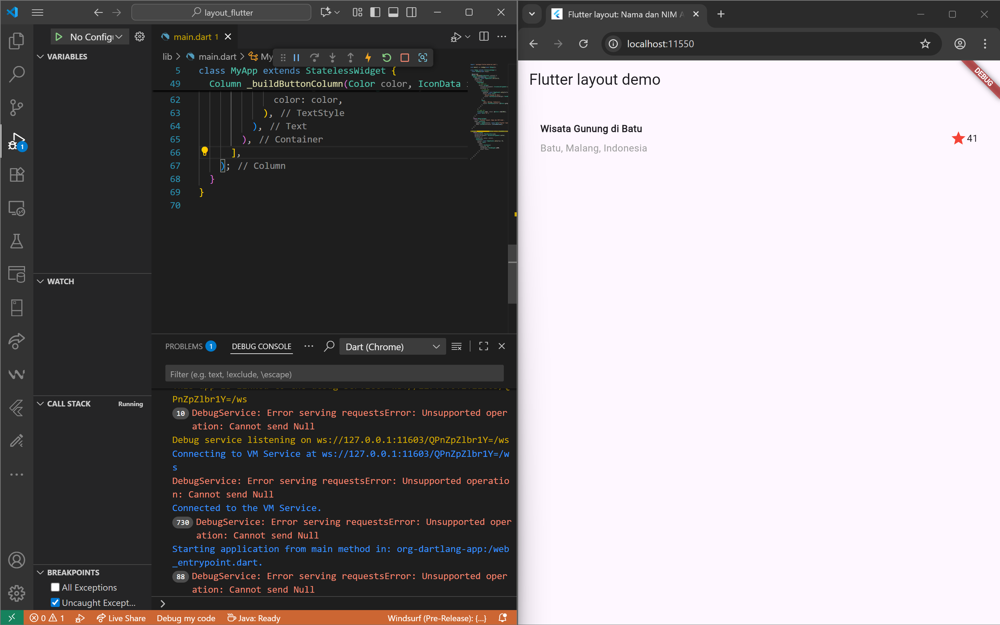
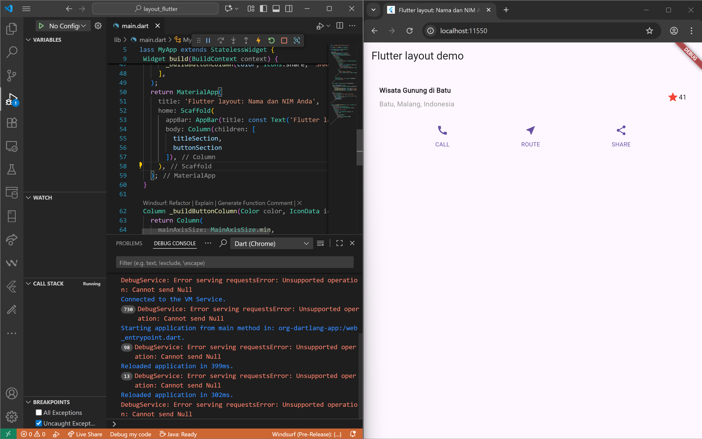
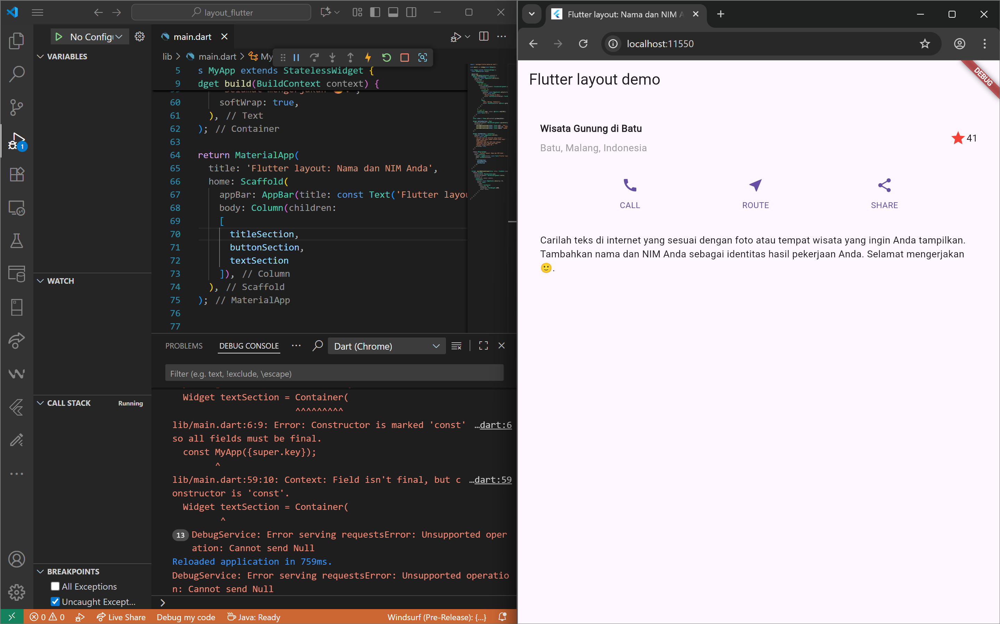
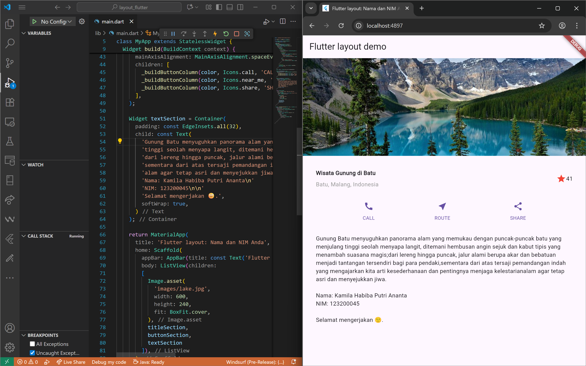

# Laporan Praktikum Flutter - Layout & Navigasi

**Nama**: Kamila Habiba Putri Ananta  
**NIM**: 2341720175  

---

## Tujuan
Mempelajari cara membuat layout dasar (Row, Column, Container, ListView) serta menerapkan navigasi antar halaman menggunakan `Navigator`.

---

## Praktikum

### Praktikum 1 Membangun Layout di Flutter dan title section
Melakukan identifikasi elemen dan tata letaknya. Setelah itu kita melakukan implementasi tittle row  

---

### Praktikum 2 Implementasi Button Row
Bagian tombol berisi 3 kolom yang menggunakan tata letak yang sama—sebuah ikon di atas baris teks. Kolom pada baris ini diberi jarak yang sama, dan teks serta ikon diberi warna primer.  

---

### Praktikum 3 Implementasi Text section
Menampilkan tulisan/teks dibawah button. Dengan memberi nilai `softWrap = true`, baris teks akan memenuhi lebar kolom sebelum membungkusnya pada batas kata.  

---

### Praktikum 4 Implementasi Image section
Menampilkan gambar pada halaman dan mengubah aturan semua elemen dari `Column` menjadi `ListView`.  

---
## Tugas Praktikum 1

## Kesimpulan
Praktikum ini membantu memahami dasar pembuatan layout di Flutter serta cara berpindah antar halaman dengan membawa data.
