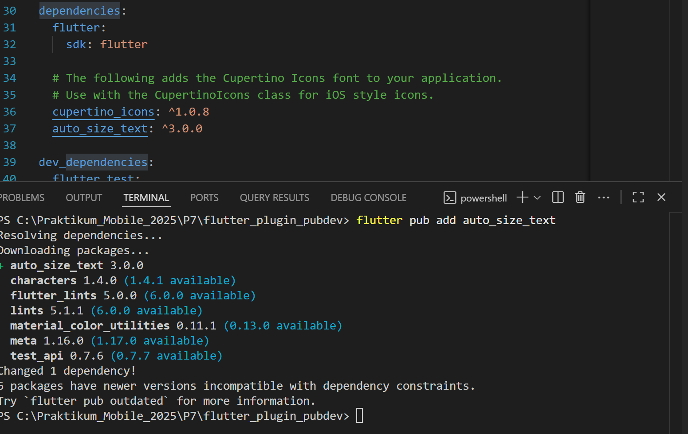
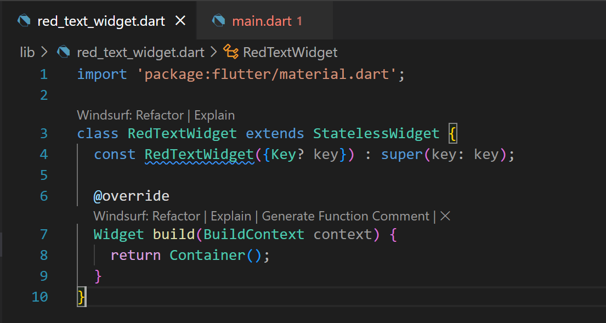
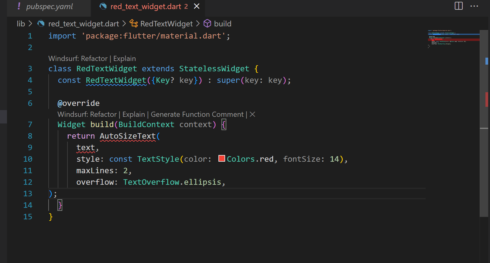
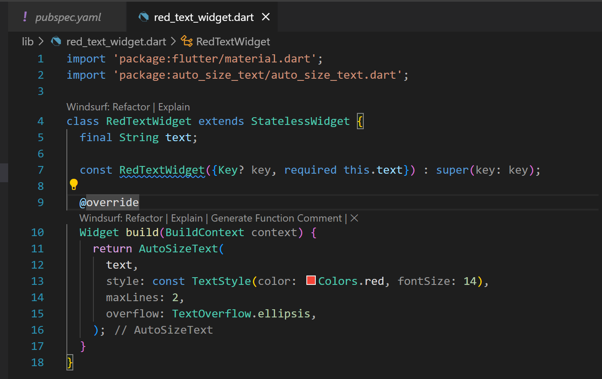
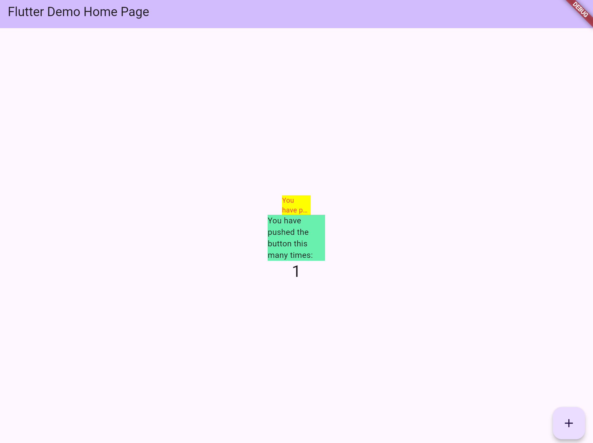

# Laporan Praktikum: Manajemen Plugin Flutter  
 
Sumber: [Flutter Codelab – Manajemen Plugin](https://jti-polinema.github.io/flutter-codelab/07-manajemen-plugin/#6)  

**Nama**   : Kamila Habiba Putri Ananta  
**NIM**    : 2341720175  
**Kelas / Program Studi** : 3D / Teknologi Informasi  

---

## Praktikum – Pemasangan & Penggunaan Plugin

### Langkah 1 – Tambah Plugin `auto_size_text`  
Menambahkan plugin `auto_size_text` ke dalam proyek melalui perintah `flutter pub add auto_size_text`. Hasilnya dapat dilihat pada file `pubspec.yaml`.  
**Hasil**  

---

### Langkah 2 – Membuat Widget `RedTextWidget` (placeholder)  
Membuat file `red_text_widget.dart` dan mendeklarasikan widget `RedTextWidget` sebagai `StatelessWidget` awal.  
**Hasil**  

---

### Langkah 3 – Gunakan `AutoSizeText` di dalam `RedTextWidget`  
Mengganti placeholder `Container()` dengan widget `AutoSizeText` yang menyesuaikan ukuran teks otomatis (`maxLines`, `overflow`).

**Error**

Pada langkah tersebut terdapat error, hal ini disebabkan karena belum ada package untuk AutoSizeText dan belum adanya pendeklarasian variabel text. Variable text digunakan untuk menyimpan teks atau rangkaian karakter.

**Pembenaran**  

---

### Langkah 4 – Tambah Parameter `text` di Constructor  
Menambahkan properti `final String text` dan parameter required `text` pada constructor `RedTextWidget` agar widget dapat menerima teks dari luar.  
**Hasil**  

---

### Langkah 5 – Tambahkan Widget di `main.dart`  
Memasukkan `RedTextWidget(text: '...')` bersama dengan widget `Text` biasa dalam `children` di `main.dart` agar kedua widget tampil pada UI.  
**Hasil**  

---

## Tugas Praktikum

1. Selesaikan praktikum tersebut, lalu dokumentasikan dan push ke repository Anda berupa screenshot hasil pekerjaan beserta penjelasannya di file `README.md`!  
2. Jelaskan maksud dari langkah 2 pada praktikum tersebut!  

    Jawab: Langkah ini membuat kerangka awal widget (skeleton) sebelum menambahkan fungsionalitas plugin. Tujuannya agar struktur file sudah tersedia

3. Jelaskan maksud dari langkah 5 pada praktikum tersebut!  

    Jawab: Langkah 5 bertujuan untuk menambahkan variabel **`text`** ke dalam kelas widget agar widget tersebut dapat menerima data teks dari luar saat digunakan. Dengan menambahkan parameter **`required this.text`** di constructor, setiap kali objek **`RedTextWidget`** dibuat, pengguna wajib memberikan nilai untuk variabel **`text`**. Kata kunci **`final`** menunjukkan bahwa nilai variabel ini bersifat tetap (immutable) setelah diinisialisasi. Selain itu, penggunaan **`const`** pada constructor memungkinkan widget ini menjadi widget konstan, yang membantu meningkatkan efisiensi performa aplikasi Flutter dengan menghindari rebuild yang tidak perlu.

4. Pada langkah 6 terdapat dua widget yang ditambahkan, jelaskan fungsi dan perbedaannya!

    Jawab: Langkah 6 bertujuan untuk menambahkan dua buah widget **Container** ke dalam tampilan aplikasi agar menampilkan teks dengan gaya yang berbeda. Container pertama berwarna **kuning** berisi widget **`RedTextWidget`**, yaitu widget kustom yang sebelumnya dibuat dan menerima teks melalui parameter **`text`**. Sedangkan Container kedua berwarna **hijau** berisi widget **`Text`** bawaan Flutter dengan teks yang sama. Perbedaan ini memungkinkan pengembang melihat hasil perbandingan antara widget kustom (**`RedTextWidget`**) dan widget bawaan (**`Text`**) dalam hal tampilan atau fungsionalitas, sekaligus memastikan bahwa widget kustom telah berfungsi sesuai harapan.
 

5. Jelaskan maksud dari tiap parameter yang ada di dalam plugin `auto_size_text` berdasarkan tautan pada dokumentasi ini! 

    Jawab:
    - style → Mengatur gaya teks (font, warna, ukuran awal).

    - maxLines → Batas jumlah baris teks.

    - minFontSize → Ukuran font terkecil yang boleh digunakan.

    - maxFontSize → Ukuran font terbesar yang boleh digunakan.

    - stepGranularity → Jarak perubahan ukuran font saat menyesuaikan.

    - presetFontSizes → Daftar ukuran font yang digunakan secara bertahap.

    - group → Menyamakan ukuran teks antar beberapa widget AutoSizeText.

    - overflowReplacement → Widget pengganti jika teks tidak muat.

    - textAlign → Mengatur perataan teks (kiri, kanan, tengah, dsb).

    - textDirection → Arah penulisan teks (LTR atau RTL).

    - locale → Mengatur lokal bahasa teks.

    - softWrap → Menentukan apakah teks boleh dibungkus ke baris baru.

    - wrapWords → Menentukan apakah pemisahan baris dilakukan antar kata.

    - overflow → Mengatur tampilan teks berlebih (misal: “...”).

    - textScaleFactor → Menyesuaikan ukuran teks dengan skala sistem.

    - semanticsLabel → Label alternatif untuk pembaca layar (aksesibilitas).
     
 
6. Kumpulkan laporan praktikum Anda berupa link repos
